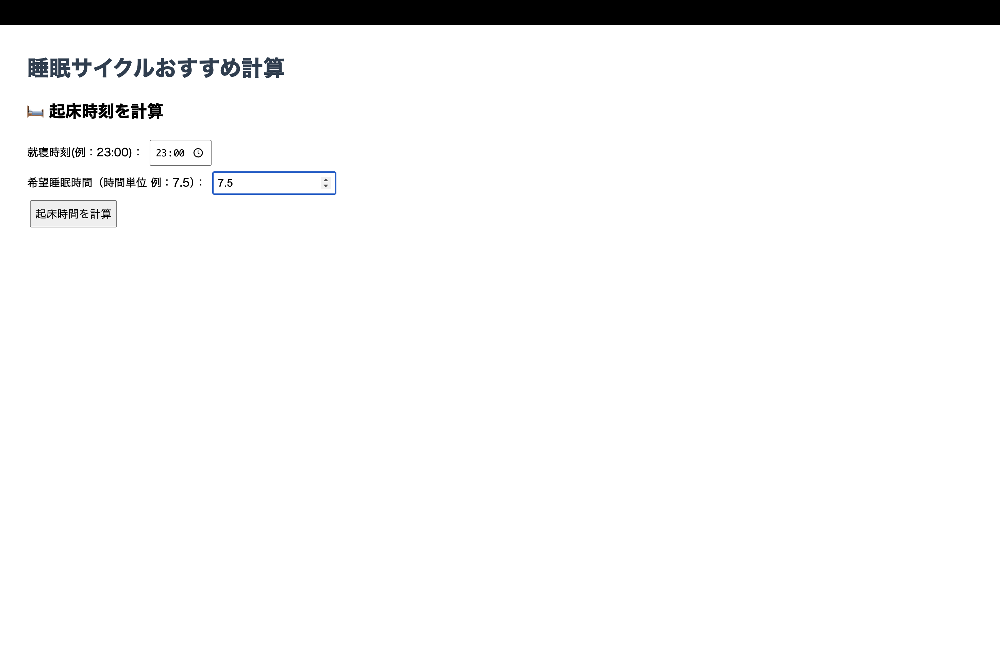
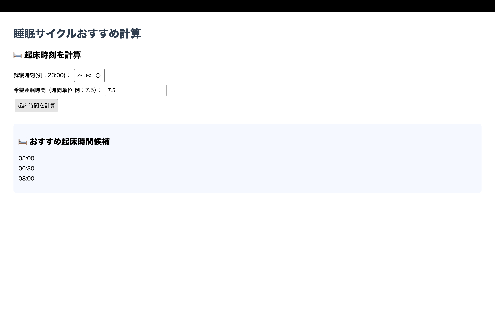
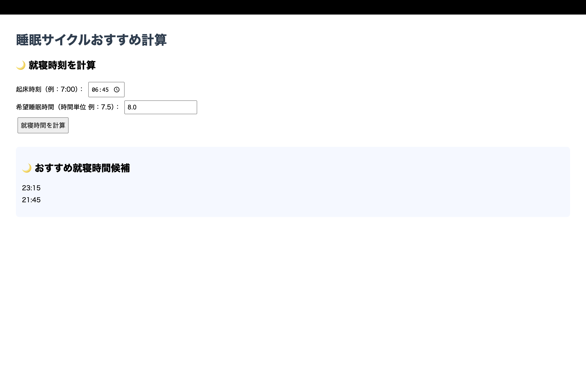

# Sleep App
●概要
Sleep App は、「起床時間」または「就寝時間」と「希望睡眠時間」を入力すると、
睡眠サイクルに基づいて快適に目覚められるおすすめの時間を自動で提案してくれる Web アプリです。

Spring Boot を学ぶ過程で、フォームの入力→計算→結果表示という一連の流れを実装し、
MVCアーキテクチャの理解を深めることを目的に作成しました。

●制作の目的

IT未経験からSEを目指す中で、
「サーバーサイドの基本的な仕組みを理解する」ことと「実務で広く利用されるフレームワークによる開発手法を理解する」ことを目標に開発しました。

コントローラー、サービス、モデル、ビューの役割を分けて設計

フォーム入力の受け取りと簡易的なバリデーション処理

計算結果をビュー（Thymeleaf）で表示する流れを実装

これにより、Spring MVC のデータの流れとビジネスロジックの分離を実践的に学びました。

●主な機能

起床時刻と希望睡眠時間から「おすすめの就寝時刻」を計算

就寝時刻と希望睡眠時間から「おすすめの起床時刻」を計算

90分サイクルの睡眠リズムを考慮した候補（３つ）を表示

HTML + Thymeleaf によるUI

●使用技術
フレームワーク	Spring Boot 3.x
言語	Java 17
テンプレートエンジン	Thymeleaf
ビルドツール	Maven
IDE	VSCode
管理ツール	Git / GitHub

●起動方法
　プロジェクトルートで実行
　mvn spring-boot:run
 
ブラウザで以下にアクセス
→ http://localhost:8080/wakeup または http://localhost:8080/bed

●画面イメージ

●学んだこと
・　Spring MVC における基本的な（Controller → Model→ Service → Model → View）の流れ
・	@ModelAttribute によるフォームデータの受け渡し
・ 	ビジネスロジックをサービス層に分離する設計の重要性
・	Thymeleaf を用いた動的な画面表示の仕組み
・ 	GitHub を利用したバージョン管理と開発フローの基礎

●今後の改善予定
・　CSSフレームワークを用いたデザイン改善
・　入力エラー時のバリデーション強化
・　ユーザーごとの履歴管理
　　ログイン機能を追加し、過去の睡眠記録やおすすめ時間を保存・参照可能にする
・　朝活Todoリストの追加
　　起床後に取り組みたいタスクを登録・管理できる機能を実装
  　睡眠結果とあわせて表示し、朝の行動計画をサポートする

 
